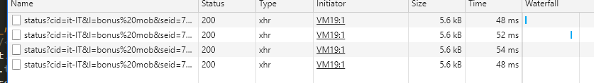

# Notifica automatica bonus mobilità

Requisiti:
- avere node.js installato
- essere già in coda

Istruzioni:
1. rinonima il file `config.template.json` in `config.json`
2. crea un bot su telegram e inserisci il token nel file config.json
3. scrivi un messaggio al bot su telegram, otteni l'id della tua chat su `https://api.telegram.org/bot<YourBOTToken>/getUpdates`
4. inserisci l'ID della tua chat dentro config.json
5. vai sul sito della coda, apri i DevTools di chrome con F12, vai sulla tab network, dopo un po' vedrai queste connessioni:

6. fai tasto destro su una connessione > copia come node.js fetch
7. incolla alla linea 11 del file index.js
8. esegui con `node index.js`
